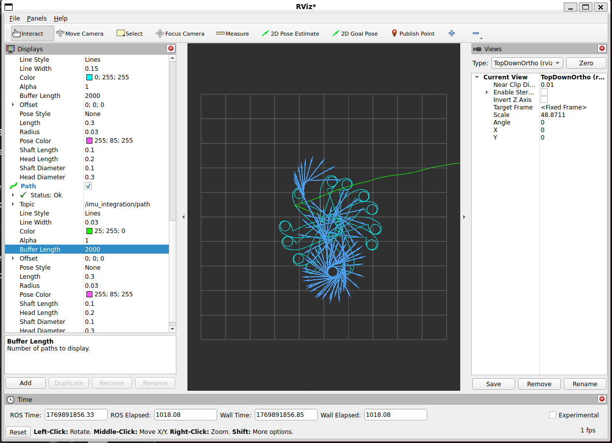

# Project 3 — Dead Reckoning (proj3_M76150518)

## Overview (What this project does)
This project performs **state estimation by dead reckoning** using a provided ROS2 bag recorded from a TurtleBot3 Burger. The goal is to estimate the robot’s 2D trajectory (x, y, yaw) using **two independent methods** and compare how each method drifts over time.

**Method 1 — Command Dead Reckoning (`/cmd_vel`)**
- Uses commanded forward velocity `v = linear.x` and yaw rate `ω = angular.z`.
- Integrates these commands in SE(2) to estimate pose:
  - θ(t+Δt) = θ(t) + ω·Δt  
  - x(t+Δt) = x(t) + v·cos(θ)·Δt  
  - y(t+Δt) = y(t) + v·sin(θ)·Δt  

**Method 2 — IMU Integration (`/imu`)**
- Uses IMU gyroscope and accelerometer:
  - Integrates `angular_velocity.z` to estimate yaw:
    - θ(t+Δt) = θ(t) + ωz·Δt
  - Rotates accelerations from **body frame → world frame** using yaw:
    - ax_world = ax_body·cos(θ) − ay_body·sin(θ)
    - ay_world = ax_body·sin(θ) + ay_body·cos(θ)
  - Double integrates acceleration to estimate position:
    - v(t+Δt) = v(t) + a·Δt
    - p(t+Δt) = p(t) + v·Δt

Both trajectories are published as `nav_msgs/Path` for RViz2 visualization and `nav_msgs/Odometry` for plotting/debugging.

---

## Bag File Details (proj3)
This project uses the provided bag `proj3` located at:
- `~/proj3_ws/proj3`

Bag format:
- Storage: **MCAP**
- ROS distro: **Jazzy**
- Duration: ~49 seconds

Topics in the bag:
- `/cmd_vel` — `geometry_msgs/msg/TwistStamped`
- `/imu` — `sensor_msgs/msg/Imu`

---

## Results Screenshot (RViz)

This screenshot shows both estimated trajectories in RViz2.

Legend:
- **Cyan** = `/dead_reckoning/path` (CmdVel dead reckoning)
- **Green** = `/imu_integration/path` (IMU integration)




---


## Comparison + Discussion (required questions)

### 1) How do the two trajectory estimates compare? Do they agree initially? When do they diverge?
They agree initially because little integration error has accumulated. Over time both drift and diverge. The CmdVel estimate follows the commanded motion pattern, while the IMU estimate diverges faster due to yaw drift and double integration of noisy acceleration.

### 2) Which method exhibits more drift? Why?
The IMU-based position estimate drifts more because position comes from double integration (accel → velocity → position). Small accelerometer bias/noise grows into velocity error and then large position error. CmdVel also drifts because commanded velocity is not exactly the robot’s true velocity, but usually less explosively.

### 3) What are the sources of error in each approach?
CmdVel:
- commanded velocity ≠ actual velocity (slip, friction, saturation, unmodeled dynamics)
- discretization / varying Δt
- planar SE(2) assumption

IMU:
- gyro bias/noise → yaw drift
- accelerometer bias/noise → major drift after double integration
- gravity leakage / imperfect compensation
- timestamp mismatch / Δt errors

### 4) How might you combine these two estimates to achieve better accuracy?
Use sensor fusion (complementary filter or EKF): use cmd_vel/wheel odometry for prediction, IMU gyro for short-term yaw stabilization, and add an external correction source (SLAM/AprilTags/VO/GPS) to remove long-term drift.

### 5) What assumptions does each method make about the robot’s motion?
CmdVel assumes the robot executes commanded (v, ω) reasonably well and motion is planar. IMU assumes yaw is accurate enough to rotate accelerations into the world frame and that accelerometer bias/noise is small (but drift grows quickly without filtering/corrections).

---

## Run Instructions (exact)

### Terminal 1 — estimator node
```bash
cd ~/proj3_ws
source install/setup.bash
ros2 run dead_reckoning estimator --ros-args -p use_sim_time:=true


### Terminal 2 — play bag
cd ~/proj3_ws
ros2 bag play proj3 --clock

### Terminal 3 — RViz2
rviz2

Verify using:
```bash
cd ~/proj3_ws
ros2 bag info proj3

